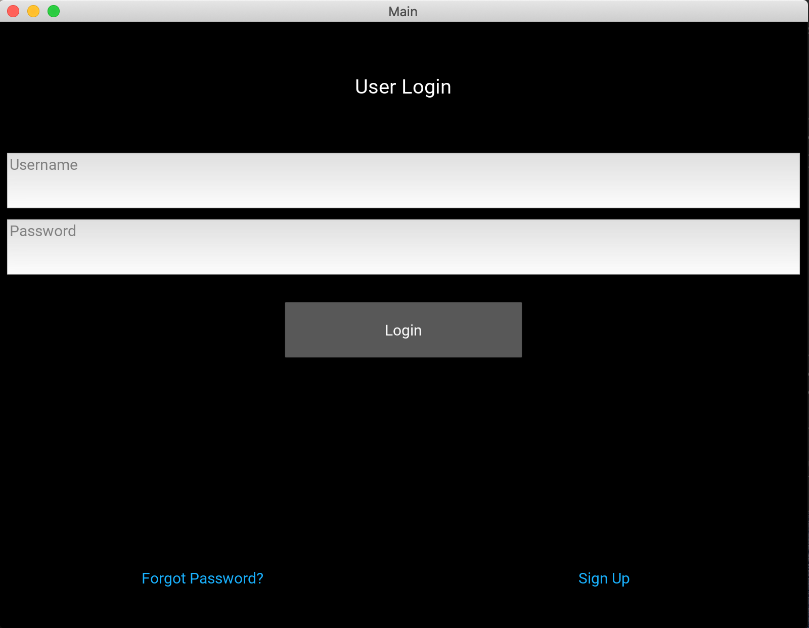

# web_app

Create an app using python (kivy) which, after signing up, it ask how you feel and it will give you an appropriate quotes.
All the login informations (username and password) are stored in a json file.
You can ask for a password if you forgot it.

Login Page:

Main Page:

Sign Up page:

Forgotten Password page:
 
